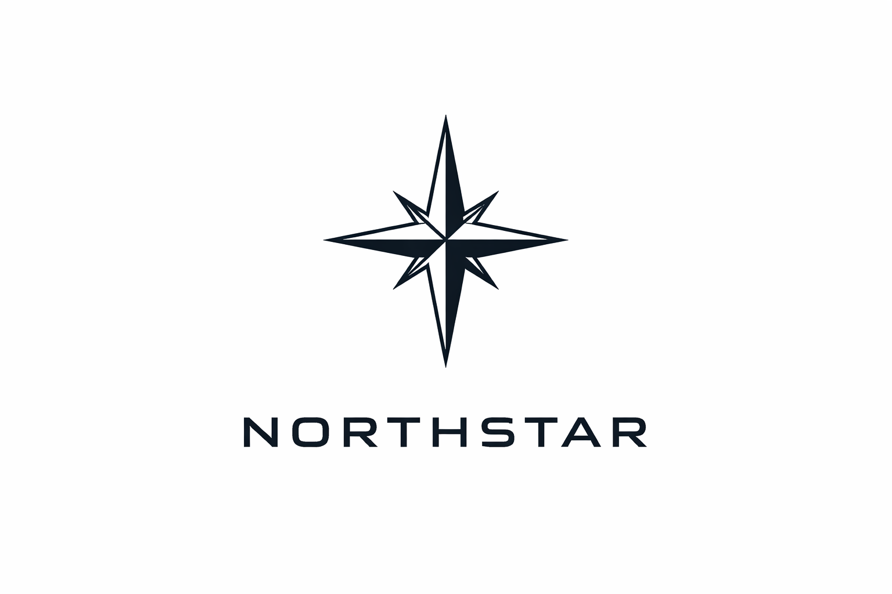
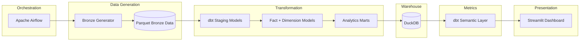
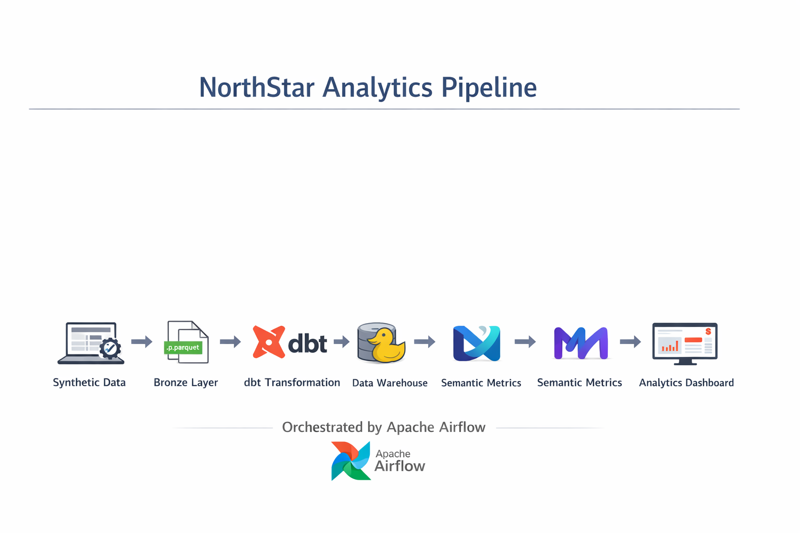
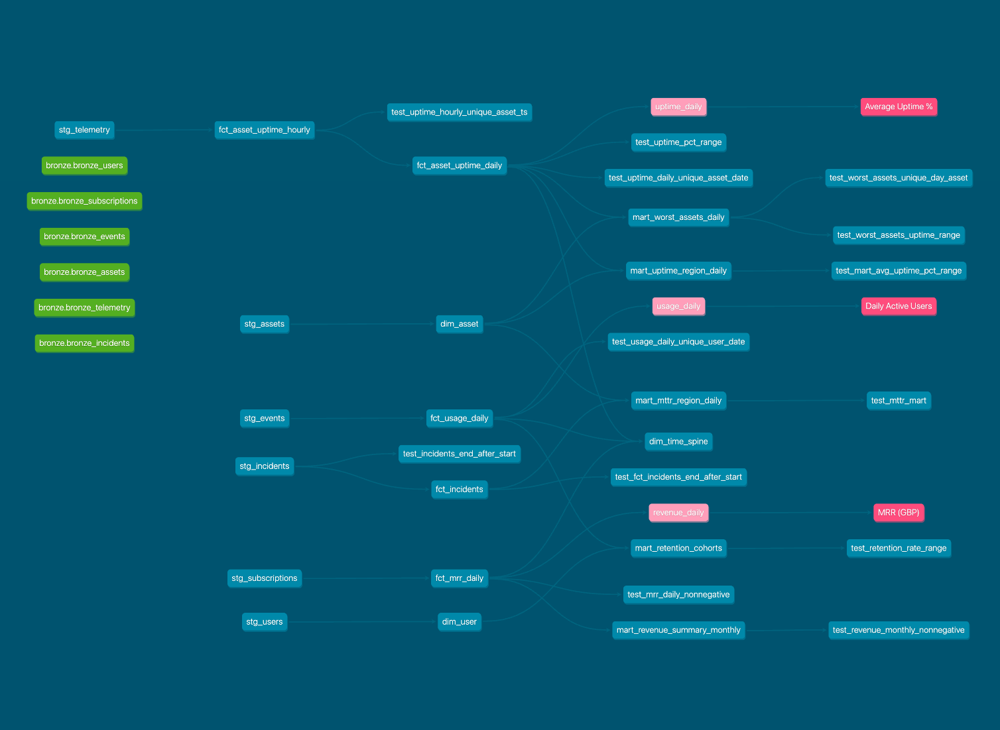
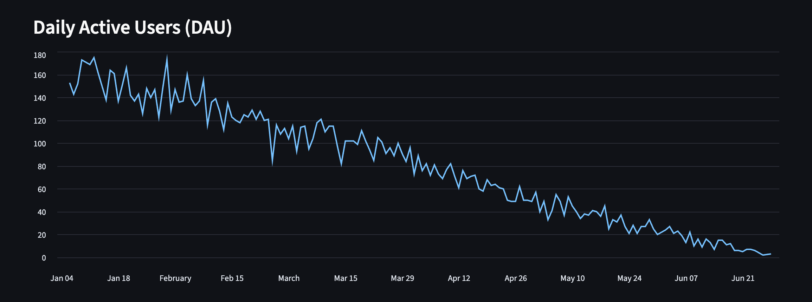
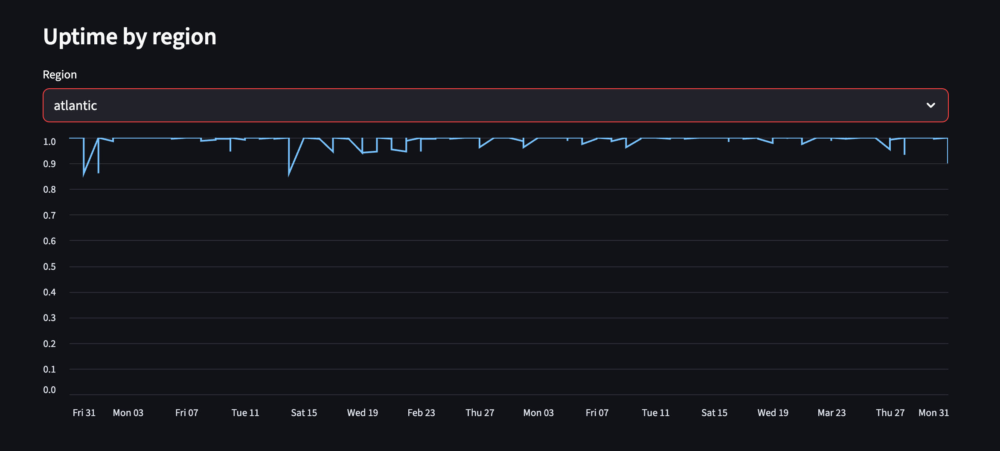
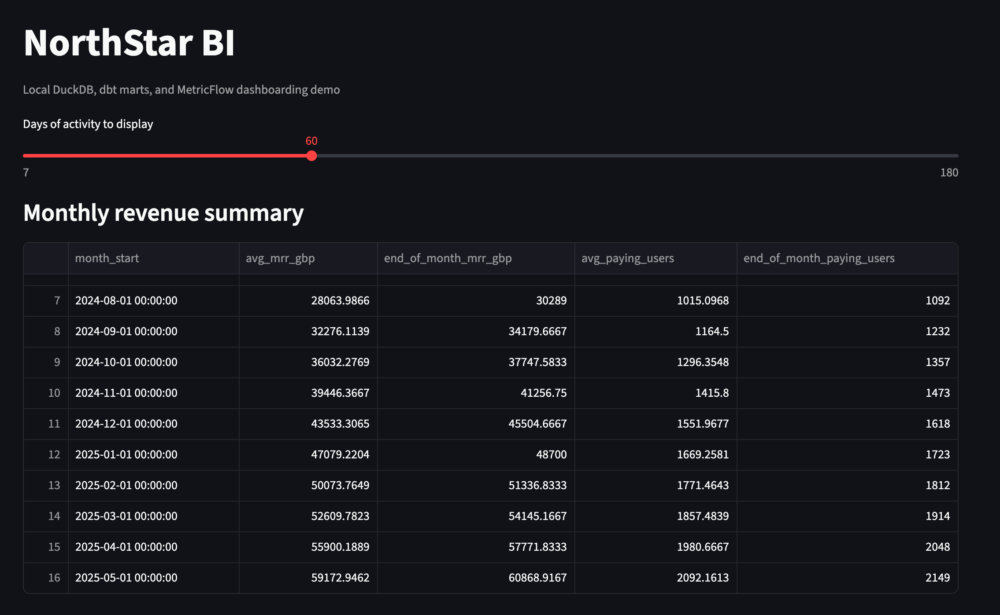
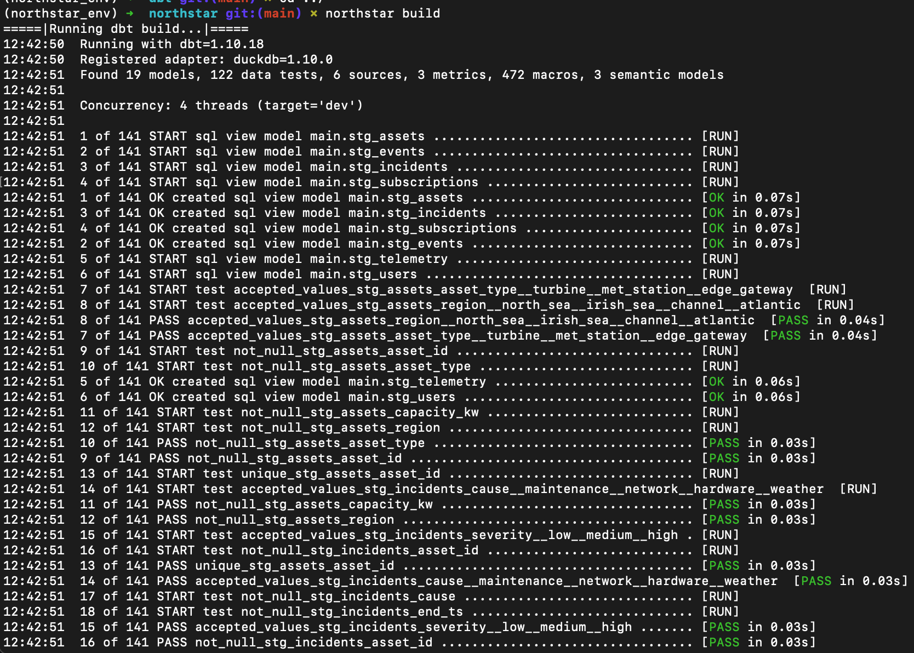
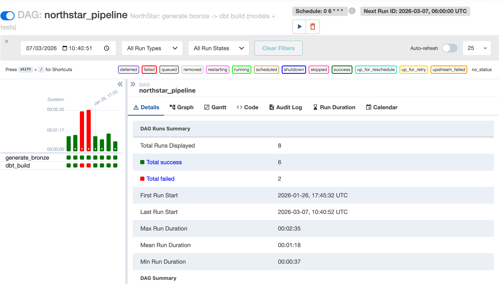

***

# NorthStar 

***


**Local Analytics Warehouse, dbt Marts, Data Quality Suite, Semantic Layer. Streamlit BI**
 
NorthStar is an analytics engineering project that builds a realistic local warehouse from scratch supporting a full simulated end-to-end SaaS analytics platform.

The project demonstrates modern data engineering practices including:

- Bronze → Silver → Gold data modeling
- dbt transformations and tests
- semantic metrics layer
- DuckDB analytical warehouse
- Streamlit dashboards
- Apache Airflow orchestration
- CLI-driven reproducible pipelines

Northstar intents do demonstrate understanding of the fundamental data architectures that enable trustworthy and robust analytics that are resilient to metric corruption and quiet failures that impact the validity of downstream data.

---


## Architecture



**NorthStar follows the conventional modern analytics engineering pattern:**

Raw Data → Transformation → Warehouse → Metrics → Dashboard



---

## NorthStar Pipeline

The system models telemetry and SaaS operation data including the following:


| Dataset       | Description                 |
| ------------- | --------------------------- |
| Users         | platform accounts           |
| Subscriptions | billing and plan data       |
| Events        | application usage telemetry |
| Assets        | monitored infrastructure    |
| Telemetry     | uptime and system metrics   |
| Incidents     | operational failures        |


The pipeline transforms this into analytical models including:

- Daily Active Users

- Monthly Recurring Revenue

- Asset uptime metrics

- Incident MTTR

- Revenue summaries

---


## Pipeline Flow

NorthStar executes the following pipeline:

1. **Bronze Generation**  
   Synthetic operational datasets are generated and written as Parquet files.

2. **Staging Transformations**  
   dbt standardizes schema, enforces types, and validates data.

3. **Data Quality Tests**  
   dbt tests ensure primary keys, accepted values, and relational integrity.

4. **Warehouse Models**  
   Facts and dimensions are built in DuckDB.

5. **Metrics Layer**  
   Business metrics such as MRR, retention, uptime, and MTTR are defined once.

6. **Dashboard**  
   Streamlit visualizes core business KPIs.

7. **Orchestration**  
   Airflow schedules and runs the entire pipeline.

---

## Data Warehouse Model 

NorthStar uses **dbt** to build the warehouse using a layered architecture:

```text
Bronze
│
├── raw ingestion tables
│
Silver (Staging)
│
├── cleaned and standardized models
│
Gold (Warehouse)
│
├── dimensions
├── fact tables
│
Analytics Marts
```


---


## Data model overview 

### Staging models (contracts + cleaning)
- `stg_users`  
- `stg_subscriptions`  
- `stg_events` (strict event_type contract)  
- `stg_assets`  
- `stg_telemetry`  
- `stg_incidents` (includes interval sanity testing)

### Gold dimensions
- `dim_asset`
- `dim_user`
- `dim_time_spine` (Semantic Layer requirement)

### Gold facts
- `fct_asset_uptime_hourly`
- `fct_asset_uptime_daily`
- `fct_incidents`
- `fct_usage_daily`
- `fct_mrr_daily`

### Reporting marts (dashboard-ready)
- `mart_uptime_region_daily`
- `mart_worst_assets_daily`
- `mart_mttr_region_daily`
- `mart_retention_cohorts`
- `mart_revenue_summary_monthly`

---

## dbt Lineage



---


## Key KPIs included
**Operational / Reliability**
- Uptime % (daily + regional aggregation)
- Worst-performing assets (top 10 per day)
- MTTR (Mean Time To Recovery) by region/type
- Incident rate per 100 assets

**Product**
- DAU (Daily Active Users)
- D7 / D30 retention (monthly cohorts)

**Revenue**
- Daily MRR (active subscription periods)
- Monthly revenue summary (avg and end-of-month MRR + paying users)

---

## Dashboard

NorthStar includes a lightweight analytics dashboard built with Streamlit.

The dashboard exposes core product metrics:


**Monthly Recurring Revenue**


**Daily Active Users**


**Asset uptime**



**The dashboard also heads with a monthly revenue summary**



---


## CLI Usage

### Create environment
Activate your environment however you prefer (conda/venv).

Install dependencies with:

```bash
pip install -e .
```

### Generate Bronze Parquet
From repo root:

```bash
northstar generate
```

This writes Parquest files into: data/bronze


### dbt: build + test warehouse

from inside dbt/:

```bash
northstar build
```

This runs:

- models (staging and marts)
- all dbt tests (schemea and singular tests)


### Semantic Layer (MetricFlow)

List metrics with:

```bash
mf list metrics
```

Some example metric queries: 

```bash
mf query --metrics mrr_gbp --group-by metric_time__month
mf query --metrics dau --group-by metric_time
mf query --metrics uptime_pct --group-by metric_time__week
```

View **dbt/SEMANTIC_LAYER.md** for more details


### Streamlit Dashboard

From the repo root:

```bash
northstar dashboard
```

**Dashboard includes:**
- Monthly MRR chart
- DAU chart (with configurable time window)
- Uptime by region (configurable and data-anchored window)


### Generate dbt Documentation

```bash
northstar docs
```


### Airflow Orchestration

Start Airflow orchestration:

```bash
northstar airflow-up
```

Stop Airflow:

```bash
northstar airflow-down
```


### Run full NorthStar Pipeline

```bash
northstar full-run
```


---

## Orchestration (Apache Airflow) Specifics

NorthStar includes a local Airflow setup to orchestrate the pipeline:

**DAG:** `northstar_pipeline`  
**Flow:** `generate_bronze` -> `dbt_build`

### What the DAG runs
1) **generate_bronze**
   - executes `python scripts/generate_bronze.py`
   - writes Bronze Parquet files to `data/bronze/`

2) **dbt_build**
   - executes `dbt build`
   - runs all staging and marts models and all dbt tests (data quality gates)

### Run Airflow locally
From the repo root:

```bash
northstar airflow-up
```

### Airflow UI:

- `http://127.0.0.1:8080` (not `localhost`)
- login with admin user (user: alex, password: northstar)

### Trigger the pipeline

- Unpause `northstar_pipeline` in Airflow UI
- Trigger manual DAG run
- View task logs for `generate_bronze` and `dbt_build`

### Notes

- Airflow containers use a custom image via `build: .` making `dbt-duckdb` avaliable inside the scheduler/webserver
- Logs are written to `/opt/airflow/logs` volume (the log direcgtory inside the container)
- **Note:** Logs are backed by a Docker volume, logs persist across restarts

### Troubleshooting

#### **Airflow UI won’t load**
- Use: `http://127.0.0.1:8080` (not `localhost`)
- Check containers:
  ```bash
  docker compose -f docker-compose.airflow.yml ps
  ```

#### **Login won't work / forgot password**

List users: 

```bash
docker exec -it northstar-airflow-webserver-1 airflow users list
```

Or create new admin user: 

```bash
docker exec -it northstar-airflow-webserver-1 airflow users create \
  --username alex \
  --firstname Alex \
  --lastname Kershaw \
  --role Admin \
  --email alex@example.com \
  --password northstar
```

#### **Task logs show `dbt: command not found`**

Airflow containers were not built with the required dbt installation.

Rebuild the custom image:

```bash
docker compose -f docker-compose.airflow.yml down
docker compose -f docker-compose.airflow.yml build
docker compose -f docker-compose.airflow.yml up -d
```

Then verify dbt exists inside the container

```bash
docker exec -it northstar-airflow-webserver-1 dbt --version
```

#### **How to view Airflow logs**

View logs from inside the webserver container:

```bash
docker exec -it northstar-airflow-webserver-1 ls -R /opt/airflow/logs | head -200
```

For a specific task attempt log:

```bash
docker exec -it northstar-airflow-webserver-1 tail -n 200 \
/opt/airflow/logs/dag_id=northstar_pipeline/run_id=<RUN_ID>/task_id=dbt_build/attempt=1.log
```

List all DAG run folders:

```bash
docker exec -it northstar-airflow-webserver-1 find /opt/airflow/logs -maxdepth 3 -type d | head -200
```

#### **Reset everything**

**Note:** Wipes Airflow users and Airflow UI history

```bash
northstar airflow-down

northstar airflow-up
```

---


## Testing and Data Quality

NorthStar uses:

- dbt schema tests: not_null, unique, accepted_values, relationships

Also uses singular tests for:

- composite grain uniqueness (e.g. asset_id + ts)
- interval sanity (end_ts > start_ts)
- metric sanity ranges (uptime within [0,1], revenue non-negative)


See dbt/TESTING.md for full coverage and philosophy.

Tests run automatically with `dbt build`.

---

## Screenshots

| Component                 | Screenshot                                       | What it Shows                                                                                                 |
| ------------------------- | ------------------------------------------------ | ------------------------------------------------------------------------------------------------------------- |
| **CLI Execution**         |         | Running `northstar build` from the CLI which orchestrates data generation, dbt models, and validation checks. |
| **dbt Lineage Graph**     |  | dbt DAG showing transformation flow from **bronze → staging → marts** models.                                 |
| **Airflow Orchestration**   |      |  Local Airflow setup to orchestrate the pipeline showing triggered pipeline run                              |
| **Dashboard (Streamlit)** |      | Interactive analytics dashboard built with Streamlit reading directly from the DuckDB warehouse.              |


## Repository structure

```text
NorthStar/
├── Dockerfile
├── README.md
├── airflow
│   └── dags
│       └── northstar_dag.py # airflow automation 
├── dashboards 
│ └── northstar_BI # Streamlit dashboard
├── scripts/
│ └── generate_bronze.py # writes Bronze Parquet
├── data/
│ └── bronze/ # generated Parquet (gitignored)
├── dbt/
│ ├── models/
│ │ ├── staging/ # stg_* models + schema.yml tests
│ │ ├── marts/
│ │ │ ├── dimensions/ # dim_* models (Gold)
│ │ │ ├── facts/ # fct_* models (Gold)
│ │ │ └── reporting/ # mart_* reporting outputs
│ │ └── semantic_metrics.yml # semantic models + metrics
│ ├── tests/ # singular tests (custom SQL)
│ ├── warehouse/ # DuckDB file (gitignored)
│ ├── TESTING.md # test philosophy + coverage
│ └── SEMANTIC_LAYER.md # MetricFlow usage
├── requirements-streamlit.txt # dashboard deps
└── README.md
├── docker-compose.airflow.yml
├── pyproject.toml
└── src
    └── northstar_metrics
        └── __init__.py
```


**Note:** 'data/' and 'dbt/warehouse/' are excluded from git.

---

## Technologies Used

NorthStar is built using modern analytics engineering tools:

| Tool           | Role                        |
| -------------- | --------------------------- |
| Python         | data generation             |
| DuckDB         | analytical warehouse        |
| dbt            | transformations and testing |
| MetricFlow     | semantic metrics            |
| Streamlit      | dashboards                  |
| Apache Airflow | orchestration               |
| Docker         | containerized workflow      |


## Intention

NorthStar demonstrates practical analytics engineering skill:

- building a warehouse from raw operational-style data
- modeling facts/dimensions cleanly
- enforcing trust via tests and contracts
- producing business KPIs and dashboard-ready marts
- defining metrics once via a semantic layer
- shipping a working BI frontend
- orchestration implementation for schedualing 

***


